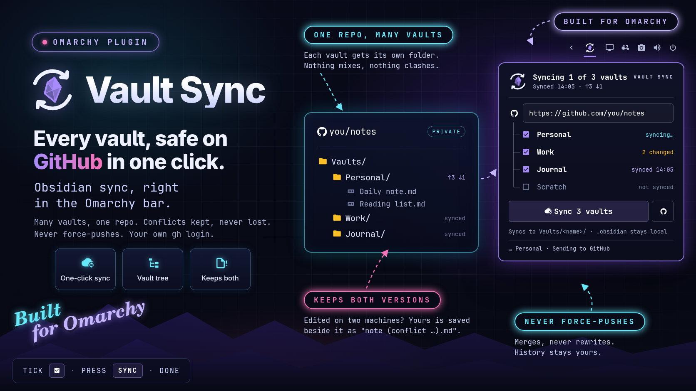

<p align="center">
  
</p>

<h1 align="center">Vault Sync</h1>

<p align="center">
  <b>Every Obsidian vault, safe on GitHub in one click.</b><br>
  Obsidian sync, right in the <a href="https://omarchy.org">Omarchy</a> bar.
</p>

<p align="center">
  <kbd>Sync now</kbd> &nbsp;·&nbsp; many vaults, one repo &nbsp;·&nbsp; conflicts kept &nbsp;·&nbsp; never force-pushes &nbsp;·&nbsp; your own gh login
</p>

<p align="center">
  
</p>

---

**Your notes live in Obsidian. Your backups shouldn't live in your head.** Did
you push the work vault last night? Is the laptop's copy newer than the
desktop's? Stop guessing.

**Click the shard in the bar.** Your GitHub repository sits at the top, with
every Obsidian vault in a tree under it. Tick the ones that belong there.

**Press Sync now.** Each ticked vault commits its notes, brings in what your
other machines pushed, and sends the result back, into its own
`Vaults/<name>/` folder. The shard turns yellow when notes change and back to
your accent color once they're safe.

## Why you'll keep it

- ☁️ **One click, every vault.** Sync now walks through every ticked vault; if one fails, the others still sync.
- 🌳 **One repo, many vaults.** Each vault gets its own `Vaults/<name>/` folder, so nothing mixes. Each repository remembers its own vaults.
- 🧩 **Know it at a glance.** The bar icon turns yellow when notes changed, and each vault's row says *synced 14:05*, *2 changed* or *failed*.
- 🤝 **Conflicts kept, never lost.** Edited the same note on two machines? GitHub's version keeps the name and yours is saved beside it as `note (conflict …).md`.
- 🛡️ **Never rewrites history.** It merges, never force-pushes, never resets.
- 🎨 **Matches your theme.** Colors and fonts come from your current Omarchy theme.
- 🔒 **Your own login.** Git signs in with your existing `gh` login; the plugin never sees a token. Details [below](#what-vault-sync-does-on-your-system).

## Install

```bash
omarchy plugin add https://github.com/chyld/omarchy-vault-sync --enable
```

Requirements: Omarchy 4 (omarchy-shell), `git`, and a GitHub login git can
use. The simplest is `gh auth login` followed by `gh auth setup-git`.

## Set up

1. Create a repository on GitHub. **Private is strongly recommended.**
2. Click the Vault Sync icon in the bar and paste the repository URL at the
   top, like `https://github.com/you/notes`.
3. Under it, tick the vaults to sync to that repository. Vault Sync lists every
   vault Obsidian knows about:

   ```
    https://github.com/you/notes
    ├─ ☑ Alpha        synced
    ├─ ☑ Beta         3 changed
    └─ ☐ Scratch      not synced
   ```

4. Press **Sync now**. Every ticked vault syncs in turn; if one fails, the
   others still sync, and the tree shows which one needs attention.

Each repository remembers its own vaults, and when they last synced. Switch
the URL to another repository and its vaults are ticked again; a repository
Vault Sync hasn't seen starts with none ticked. This is kept in
`~/.config/vault-sync/repos.json`:

```json
{
  "version": 1,
  "migrated": true,
  "repos": {
    "https://github.com/you/notes": {
      "vaults": ["/home/you/Documents/Alpha", "/home/you/Documents/Beta"],
      "lastSync": "2026-09-23T22:15:04-07:00",
      "lastSummary": "↑2 ↓1",
      "synced": {
        "/home/you/Documents/Alpha": "2026-09-23T22:15:04-07:00",
        "/home/you/Documents/Beta": "2026-09-23T22:15:05-07:00"
      }
    }
  }
}
```

`lastSync` is when Sync now last finished for the repository, and `synced` is
when each vault last synced to it successfully.
You can edit it by hand; Vault Sync picks up the change.

If the repository is public, the popup says so: anyone on the internet can read
every note you sync.

## What a sync does

One repository can hold any number of vaults. Each vault gets its own folder:

```
Vaults/
  Alpha/    ← ~/Documents/Alpha
  Beta/     ← ~/Documents/Beta
```

The folder is named after the vault's folder, so give each vault a distinct
name. On your computer nothing changes: the notes stay at the top of the vault.

1. The first time, it runs `git init` in the vault and points `origin` at your repository.
2. It commits your changes with a message like `Sync 2026-09-23 14:05 — 3 files changed`.
3. It fetches the repository and **merges** what other devices pushed to this
   vault's folder, and nothing else.
4. It writes the result back into the vault's folder, next to the other vaults,
   and pushes. If GitHub moved on during the sync, it fetches and merges once more.
5. It tells you what happened in the popup: files uploaded, files downloaded
   and notes kept twice (`Synced 14:05 · ↑3 ↓2`).

It never force-pushes, never resets and never rewrites history.

**Notes only.** Obsidian's `.obsidian` folder (settings, plugins, workspace
layout) and `.trash` stay on this machine.

## Conflicts: both versions are kept

When the same note changed here and on another device, GitHub's version keeps
the name and yours is saved beside it:

```
todo.md                              ← the version from GitHub
todo (conflict 2026-09-23 1405).md   ← your version
```

The sync finishes, and the icon shows the conflict until you merge the two by
hand and delete the `(conflict …)` copy. When one device deleted a note and the
other edited it, the edit is kept.

## The icon

An obsidian shard (your vault) inside two sync arrows. It changes with the state:

| The mark | Means |
|---|---|
| gem in your theme's accent colour | up to date |
| gem in your theme's yellow | notes changed since the last sync (checked every 5 minutes) |
| the arrows turn | syncing |
| plain gem with a red dot | conflict copies in the vault |
| red gem, faded arrows | the last sync failed (the popup says why) |
| faded gem, dashed ring | not set up |

Middle-click the icon to sync without opening the popup.

## What Vault Sync does on your system

- **Network:**
  - When you press Sync now: `git ls-remote`, `fetch` and `push` to the
    repository you entered, and nowhere else.
  - One anonymous request to `api.github.com/repos/<owner>/<repo>` per
    repository URL per session (when the shell starts and when you enter a
    URL; opening the popup asks again only if the last answer didn't come
    back), to warn you if the repository is public. It sends no credentials,
    follows no redirects and reads nothing but the status code.
- **Credentials:** git signs in with the credential helper already in your git
  config (for example `gh auth setup-git`). The token passes between git and
  that helper over git's credential protocol; it never appears in a command
  line, and Vault Sync never sees, stores or logs it.
- **Files it writes:**
  - `~/.config/vault-sync/repos.json`: which vaults sync to which repository,
    and when. Written by `files.py` at mode 0600 in a 0700 directory, through
    an exclusively created temporary that is renamed into place.
  - Inside each ticked vault, only when you press Sync now: its `.git` folder
    (including two refs per repository under `refs/vault-sync/<owner>/<repo>/`
    and a separate index file, `.git/vault-sync-index`, used to build the
    repository's tree), and the conflict copies described above.
  - The repository URL, saved on Vault Sync's bar entry in
    `~/.config/omarchy/shell.json` by the Omarchy shell.
- **Files it reads:** Obsidian's vault list (`~/.config/obsidian/obsidian.json`),
  the current theme's `colors.toml` (for its yellow) and `repos.json`, each
  through `files.py`: opened once without following a symlink, checked to be a
  regular file of yours, and size-limited. Every 5 minutes (and when the popup
  opens) it also runs a local `git status` in each ticked vault, with no
  network.
- **Commands:** all run with an argument list, never through a shell, with a
  fixed `PATH` and no inherited environment, each under `/usr/bin/timeout` so
  a deadline stops the command and everything it started:
  `/usr/bin/git`, `/usr/bin/python3` (`files.py`), `/usr/bin/find` (files over
  50 MB), `/usr/bin/test` and `/usr/bin/mv` (conflict copies), `/usr/bin/curl`
  (the public check), and Omarchy's `omarchy-launch-browser` (Open on GitHub).
- **git in your vaults** never runs hooks or an fsmonitor, and a symlink that
  arrives from GitHub is checked out as a plain file, never as a link.
- **No desktop notifications.** While a sync runs, the bottom of the popup
  shows the step in progress in small text; it disappears when the sync ends.
  What the sync moved shows in the header (`Synced 14:05 · ↑3 ↓2`), and
  failures and conflicts on the icon and each vault's row.
  GitHub refuses files over 100 MB, so a sync with one stops before committing
  anything.

## Remove

```bash
omarchy plugin remove chyld.vault-sync
```

That removes the plugin and its bar entry, including the repository URL in
`~/.config/omarchy/shell.json`. Nothing keeps running afterwards. What stays:

- **Each synced vault's `.git` folder**, with your notes' history, the
  `refs/vault-sync/…` refs and `.git/vault-sync-index`. Your notes themselves
  are untouched. Delete a vault's `.git` folder only if you no longer want it
  to be a git repository.
- **`~/.config/vault-sync/repos.json`** (which vaults sync to which
  repository). Delete that file, then the empty `~/.config/vault-sync` folder,
  if you don't want it kept.
- **Your GitHub repository**, which Vault Sync never deletes.

## Development

| File | Role |
|---|---|
| `Service.qml` | Settings, local status, and the sync itself |
| `Settings.qml` | The bar icon and its popup |
| `Logo.qml` | The mark, drawn as vectors, changing with the sync state |
| `Runner.qml` | Runs one command at a time: minimal environment, byte budget, and a deadline that stops the whole process group |
| `files.py` | Every read and write outside a vault's repository, through checked descriptors |
| `Commands.js` | Every command Vault Sync runs |
| `Safe.js` | Validation and parsing of everything that is not a literal |

Run the tests with `node --test tests/` and
`/usr/bin/python3 -B -m unittest discover -s tests`. The manifest sets `keepLoaded`, so
after changing `Service.qml` or anything it loads, run `omarchy restart shell`.

## License

MIT
